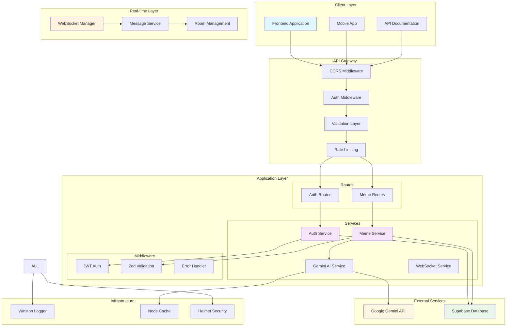

# 🚀 CyberMall - Meme Platform Backend

A production-ready Node.js backend for a cyberpunk-themed meme platform with real-time features, AI-powered content generation, and comprehensive user management.

## 🌟 Features

### 🔐 Authentication & Authorization
- **JWT-based Authentication** with 30-day token validity
- **Secure Password Hashing** using bcryptjs with salt rounds
- **User Registration & Login** with comprehensive validation
- **Protected Routes** with middleware-based authorization

### 🎭 Meme Management
- **AI-Powered Content Generation** using Google's Gemini API
- **Automated Caption & Vibe Generation** for memes
- **Tag-based Categorization** with cyberpunk themes
- **User-specific Meme Collections**

### 🗳️ Interactive Features
- **Real-time Voting System** (upvotes/downvotes)
- **Bidding Mechanism** with transaction tracking
- **Dynamic Leaderboards** with multiple sorting options
- **Trending Meme Detection** with milestone broadcasts

### ⚡ Real-time Communication
- **WebSocket Integration** using Socket.IO
- **Real-time Notifications** for votes, bids, and new memes
- **User Presence Management** with online/offline status
- **Room-based Messaging** for scalable communication

### 📊 Advanced Features
- **Comprehensive Logging** using Winston
- **Request Validation** with Zod schemas
- **API Documentation** with Swagger/OpenAPI
- **Performance Optimization** with compression and caching
- **Security Headers** with Helmet.js

## 🛠️ Technology Stack

### **Backend Framework**
- **Node.js** - Runtime environment
- **Express.js** - Web application framework
- **Socket.IO** - Real-time bidirectional communication

### **Database & Storage**
- **Supabase** - PostgreSQL database with real-time features
- **PostgreSQL** - Relational database for data persistence

### **AI & ML**
- **Google Gemini API** - AI-powered content generation
- **Node-Cache** - In-memory caching for AI responses

### **Authentication & Security**
- **JWT (jsonwebtoken)** - Token-based authentication
- **bcryptjs** - Password hashing
- **Helmet.js** - Security headers
- **CORS** - Cross-origin resource sharing

### **Validation & Documentation**
- **Zod** - Runtime type validation
- **Swagger/OpenAPI** - API documentation
- **Winston** - Comprehensive logging

### **Development & Production**
- **Nodemon** - Development hot reloading
- **Compression** - Response compression
- **dotenv** - Environment variable management

## 🏗️ Architecture Overview



## 🚀 Getting Started

### Prerequisites
- Node.js (v16 or higher)
- PostgreSQL database (or Supabase account)
- Google Gemini API key

### Installation

1. **Clone the repository**
   ```bash
   git clone https://github.com/your-username/cybermall-backend.git
   cd cybermall-backend
   ```

2. **Install dependencies**
    ```bash
    npm install
    ```

3. **Environment Setup Create a .env file in the root directory:**
    ```bash
    PORT=4001
    NODE_ENV=development

    # Database Configuration
    SUPABASE_URL=your_supabase_url
    SUPABASE_ANON_KEY=your_supabase_anon_key

    # AI Service
    GEMINI_API_KEY=your_gemini_api_key

    # Authentication
    JWT_SECRET=your_super_secret_jwt_key

    # CORS Configuration
    CLIENT_URL=http://localhost:3000
    ```

4. **Database Setup Run the SQL queries from queries.sql in your PostgreSQL database.**

5. Start the server
    ```bash
    # Development
    npm run dev

    # Production
    npm start
    ```


### Authentication Endpoints

| Method | Endpoint | Description |
|--------|----------|-------------|
| POST | `/auth/register` | Register a new user |
| POST | `/auth/login` | Login user |
| GET | `/auth/profile` | Get user profile (Protected) |
| POST | `/auth/verify` | Verify JWT token (Protected) |

### Meme Endpoints

| Method | Endpoint | Description |
|--------|----------|-------------|
| POST | `/memes` | Create a new meme |
| GET | `/memes/user/:username` | Get user's memes |
| POST | `/memes/bid` | Place a bid on meme |
| POST | `/memes/vote` | Vote on meme |
| POST | `/memes/leaderboard` | Get memes leaderboard |

### WebSocket Events

| Event | Direction | Description |
|-------|-----------|-------------|
| `authenticate` | Client → Server | Authenticate user |
| `bid_update` | Server → Client | Broadcast bid updates |
| `vote_update` | Server → Client | Broadcast vote updates |
| `new_meme` | Server → Client | Broadcast new memes |
| `meme_highlight` | Server → Client | Trending meme notifications |

## 📖 Interactive API Documentation

Visit `/api-docs` when the server is running to access the [Swagger UI](https://cyberplace-be.onrender.com/api-docs/) documentation with interactive API testing capabilities.

## 🔧 Configuration

### Environment Variables

| Variable | Description | Default |
|----------|-------------|---------|
| `PORT` | Server port | 4001 |
| `NODE_ENV` | Environment mode | development |
| `LOG_LEVEL` | Logging level | info |
| `JWT_SECRET` | JWT signing secret | Required |
| `SUPABASE_URL` | Supabase project URL | Required |
| `SUPABASE_ANON_KEY` | Supabase anonymous key | Required |
| `GEMINI_API_KEY` | Google Gemini API key | Required |

## 📈 Performance & Monitoring

### Logging
- **Winston Logger** with multiple transports
- **Structured Logging** with JSON format
- **Error Tracking** with stack traces
- **Request Logging** for debugging

### Caching
- **In-memory Caching** for AI responses
- **Response Compression** for better performance
- **Connection Pooling** for database efficiency

### Security
- **Helmet.js** for security headers
- **CORS Protection** with configurable origins
- **Rate Limiting** (configurable)
- **Input Validation** with Zod schemas


## 🔮 Future Enhancements

### 🎯 Short-term Improvements
- [ ] **Rate Limiting Implementation** - Prevent API abuse
- [ ] **Redis Integration** - Distributed caching and sessions
- [ ] **Email Verification** - User account verification
- [ ] **Password Reset** - Forgot password functionality
- [ ] **Input Sanitization** - XSS protection
- [ ] **API Versioning** - Future-proof API evolution

### 🚀 Medium-term Features
- [ ] **User Profiles** - Extended user information and avatars
- [ ] **Meme Categories** - Advanced categorization system
- [ ] **Follow System** - User following and followers
- [ ] **Notification System** - In-app and email notifications

### 🔧 Technical Improvements
- [ ] **TypeScript Migration** - Type safety and better DX
- [ ] **Docker Containerization** - Simplified deployment
- [ ] **CI/CD Pipeline** - Automated testing and deployment
- [ ] **Health Checks** - Application monitoring
- [ ] **Metrics Collection** - Prometheus/Grafana integration

## 🤝 Contributing

1. Fork the repository
2. Create a feature branch (`git checkout -b feature/amazing-feature`)
3. Commit your changes (`git commit -m 'Add amazing feature'`)
4. Push to the branch (`git push origin feature/amazing-feature`)
5. Open a Pull Request

### Development Guidelines

- Follow the existing code style and conventions
- Write meaningful commit messages
- Add tests for new features
- Update documentation as needed
- Ensure all tests pass before submitting PR

### Code Standards

- Use ESLint and Prettier for code formatting
- Follow REST API naming conventions
- Implement proper error handling
- Add appropriate logging for debugging
- Validate all inputs using Zod schemas

## 📬 Contact

For questions, contributions, or feedback:

[](https://github.com/srrathi)
[](https://www.linkedin.com/in/sitaram-rathi-519152197/)
[](mailto:srrathi2000@gmail.com)
[](https://twitter.com/SitaramRathi5)
[](https://dev.to/srrathi)
